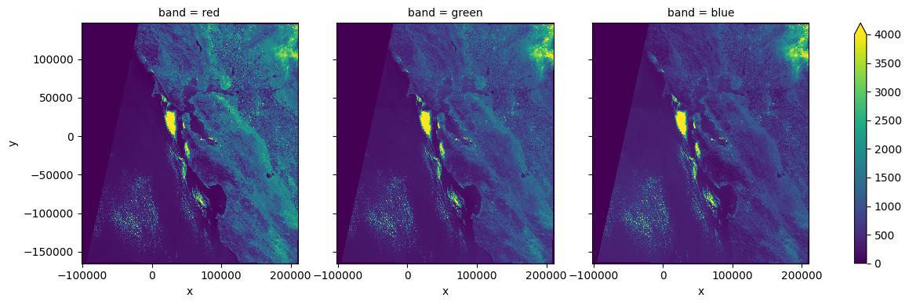
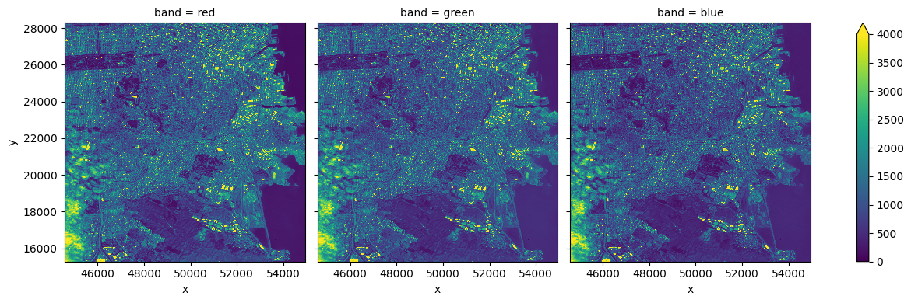

## Portfolio

---

### Using Visual Studio Code to Produce A Global Scale Project with DASK, AWS, and Sentinel-2A Images

<a href='https://github.com/geodegarmo/maxar_project'>GitHub Tutorial on Setting Up An Environment using pip</a>

---
### North Mills River Landslide
<a href='https://sooners-my.sharepoint.com/:v:/r/personal/christopher_j_degarmo-1_ou_edu/Documents/Attachments/MappedLandslide_withDEMS2.mp4?csf=1&web=1&e=LYjyLx&nav=eyJyZWZlcnJhbEluZm8iOnsicmVmZXJyYWxBcHAiOiJTdHJlYW1XZWJBcHAiLCJyZWZlcnJhbFZpZXciOiJTaGFyZURpYWxvZy1MaW5rIiwicmVmZXJyYWxBcHBQbGF0Zm9ybSI6IldlYiIsInJlZmVycmFsTW9kZSI6InZpZXcifX0%3D'>North Mills River Landslide</a>

---
[Project 3 Title](http://example.com/)

---

### Category Name 2

- [Project 1 Title](http://example.com/)
- [Project 2 Title](http://example.com/)
- [Project 3 Title](http://example.com/)
- [Project 4 Title](http://example.com/)
- [Project 5 Title](http://example.com/)

---

---

Page template forked from <a href="https://github.com/evanca/quick-portfolio">evanca</a>

<!-- Remove above link if you don't want to attibute -->
