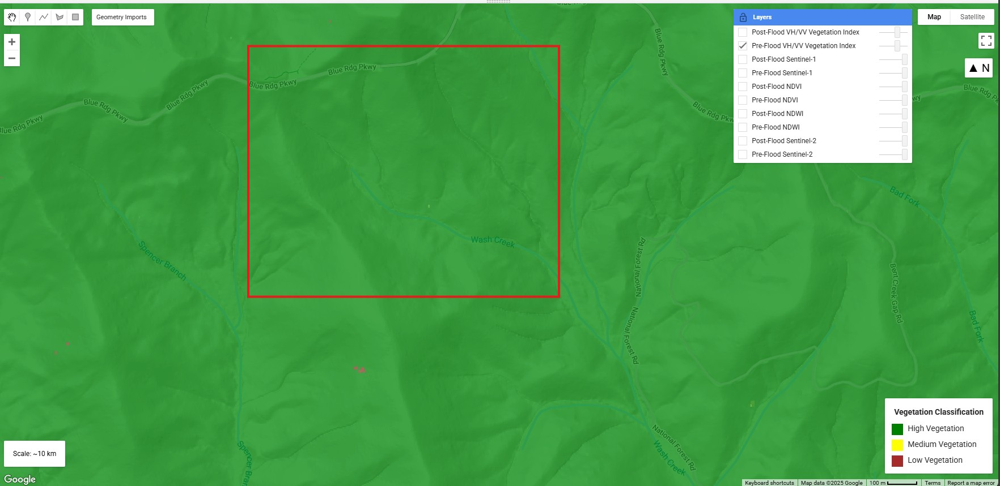
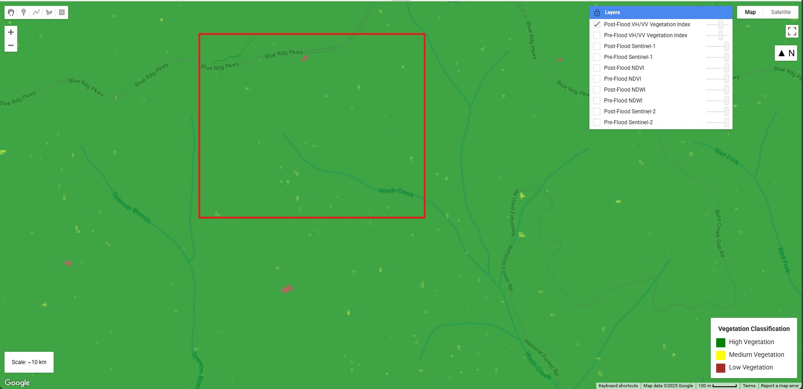
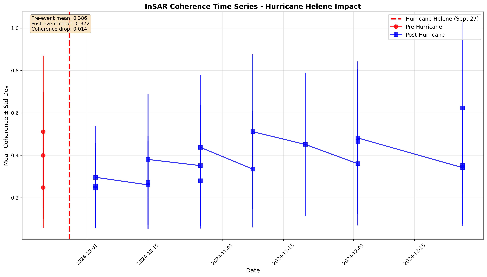
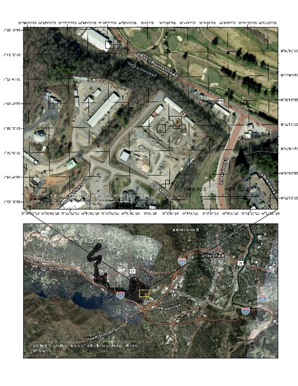
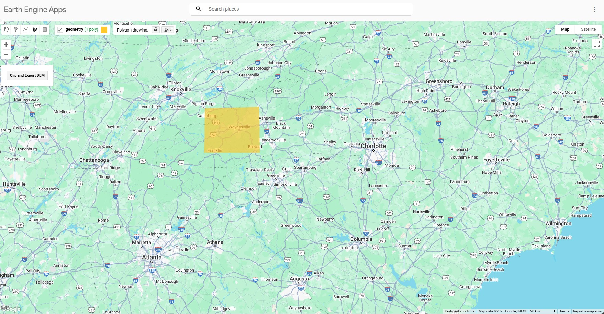

## Portfolio
---

### Hurricane Helene Impact Analysis Using Google Earth Engine

*VV-VH radar vegetation index showing vegetation health changes across the study region*

**Key Results:**
- Mapped massive and destructive landslide at wash creek (-82.68, 35.45) with a total of 19,226 m² affected area
- Quantified vegetation health changes using VV-VH radar vegetation index
- Developed interactive Earth Engine applications for damage visualization

<a href='https://ee-degarmocjd.projects.earthengine.app/view/vegetationhealths1-s2'>Interactive Vegetation Health Application</a> | 
<a href='https://sooners-my.sharepoint.com/:v:/r/personal/christopher_j_degarmo-1_ou_edu/Documents/Attachments/MappedLandslide_withDEMS2.mp4?csf=1&web=1&e=LYjyLx](https://sooners-my.sharepoint.com/:v:/g/personal/christopher_j_degarmo-1_ou_edu/IQDQ5ncrgtKWSKr5JpJcrY71AbMIDDYavs6012pKH7ArIvM?nav=eyJyZWZlcnJhbEluZm8iOnsicmVmZXJyYWxBcHAiOiJTdHJlYW1XZWJBcHAiLCJyZWZlcnJhbFZpZXciOiJTaGFyZURpYWxvZy1MaW5rIiwicmVmZXJyYWxBcHBQbGF0Zm9ybSI6IldlYiIsInJlZmVycmFsTW9kZSI6InZpZXcifX0%3D&e=S14nZJ'>Landslide Drone Survey Video</a>

**Technologies:** Google Earth Engine, Python, ArcGIS Pro, sUAS Mapping

### Hurricane Helene Disaster Assessment: SAR Coherence Change Detection
**Master's Capstone Project | University of Oklahoma**

*Comprehensive 6-panel spatial coherence analysis showing pre/post event coherence, change detection, and statistical validation (Gi*, Moran's I)*

*Temporal coherence trends revealing 3-phase recovery pattern and optimal 12-day baseline performance across 132-day monitoring period*

 
 
*Ground truth validation with imagery: Swannanoa River area before and after Hurricane Helene, showing catastrophic surface disruption detected via coherence loss in S1 and verified with high-res imagery*

First comprehensive application of SAR coherence change detection to a major inland hurricane event in mountainous terrain. Developed automated Python workflows for operational disaster response, processing 21 Sentinel-1A interferograms across 132 days to map flood inundation, landslides, and surface modifications across Western North Carolina's complex Appalachian topography.

**Comprehensive Damage Assessment:**
- Processed 8.7M pixels at 10m resolution covering Western NC's hurricane-affected region
- Detected surface changes across 19.3% of study area (1.7M pixels) with significant coherence loss
- Mapped individual landslide at (-82.68, 35.45) with 19,226 m² affected area using integrated InSAR-optical analysis
- Quantified vegetation health changes using VV-VH radar vegetation index for ecosystem impact assessment
- Validated 8.8% of study area as statistically significant change using Getis-Ord Gi* and Local Moran's I spatial statistics

**Key Methodological Innovations:**
- Established 12-day temporal baseline as optimal for coherence preservation in mountainous flood scenarios (26% better performance than 36-day baselines, R² = 0.73)
- Achieved 100% processing success rate across 21 interferometric pairs with automated Python workflows
- Implemented maximum-likelihood change detection with spatial autocorrelation analysis (hot spot detection)
- Identified 157,691 pixels (1.8%) as statistically significant hot spots with maximum Z-scores reaching 6.678 (p < 0.05)

**Recovery Timeline Documentation:**
- Documented 3-phase recovery pattern: immediate impact (coherence 0.338) → early recovery (0.474) → late recovery (0.519)
- Measured rapid initial recovery rate of +0.136 coherence units over 24 days
- Established ~60-day timeline to near-baseline conditions
- Final interferogram (Dec 2-26) achieved 0.624 coherence, exceeding pre-hurricane baseline

**Operational Impact:**
- Developed reproducible methodology applicable to other disaster events and geographic regions
- Created automated processing chain averaging 15 minutes per interferogram on HPC hardware
- Challenged traditional assumptions that mountainous regions provide natural hurricane protection
- Provided quantitative framework for disaster preparedness in previously "low-risk" inland areas
- Addressed hurricane causing $53-59.6B in damage, 107+ deaths in NC, and affecting 126,000+ homes

**Interactive Tools & Applications:**
- Developed Earth Engine applications for real-time damage visualization and assessment
- Created interactive vegetation health monitoring system for pre/post disaster comparison
- Integrated multi-sensor approach combining InSAR, optical, and elevation data

<a href='[link to full paper]'>Full Research Paper (60+ pages) "Coming soon"</a> | 
<a href='https://ee-degarmocjd.projects.earthengine.app/view/vegetationhealths1-s2'>Interactive Vegetation Health Application</a> | 

**Technologies:** Sentinel-1 InSAR (SLC, IW mode), SNAP/SNAPPY, Python (rasterio, GDAL, scikit-learn, NumPy), Sentinel-2, Google Earth Engine, ISCE2, Copernicus DEM, MAXAR WorldView, Getis-Ord Gi*, Local Moran's I, Maximum-Likelihood Change Detection, Enhanced Spectral Diversity Coregistration

**Research Significance:** Among the first comprehensive coherence change detection studies of inland mountainous hurricane impacts. Established new benchmarks for SAR-based disaster assessment in topographically complex environments. Contributed to enhanced understanding of hurricane impacts in regions previously considered low-risk, with direct implications for climate adaptation and disaster risk reduction strategies.

---
---

### Wildfire Detection Using Deep Learning
**R&D Project | Wiser Imagery Services**

[Add image of fire detection model output or confusion matrix]

Developed PyTorch-based deep learning models for automated wildfire detection from satellite imagery. Compared CNN architectures with traditional Support Vector Machine approaches for real-time fire monitoring applications.

**Key Results:**
- [Add specific accuracy/performance metrics]
- [Mention processing speed or scale]

<a href='[GitHub link if available]'>View Project Details</a>

**Technologies:** PyTorch, Python, Sentinel-2, [other relevant tools]

---

### Continental-Scale Land Cover Classification Pipeline
**Current Development Project**

[Add visualization of land cover results]

Building an operational 2-meter resolution land cover pipeline for continental-scale processing using Sentinel-2 imagery and super-resolution techniques. Designed for efficient processing of large geographic areas with DASK and cloud computing.

**Key Features:**
- 2m resolution output from 10m Sentinel-2 input
- Scalable architecture using DASK for parallel processing
- AWS integration for large-scale deployment

<a href='https://github.com/geodegarmo/maxar_project'>GitHub Repository</a>

**Technologies:** Python, DASK, AWS, Sentinel-2, GDAL, Rasterio

---

### Custom ArcGIS Pro Tooling Development
**R&D Project | Wiser Imagery Services**

[Add screenshot of tool interface]

Developed custom ArcGIS Pro add-in tools to automate cartographic workflows, improving team efficiency for elevation annotation and contour labeling tasks.

**Tools Created:**
- Automated contour annotation system
- Intelligent elevation labeling with conflict avoidance
- [Other tools if applicable]

<a href='[GitHub link if available]'>View Code</a>

**Technologies:** ArcGIS Pro SDK, Python, C#

---

### Interactive Geospatial Web Applications
**Google Earth Engine Development**

Created interactive Earth Engine applications for geospatial analysis and data export workflows.

**Applications:**
- <a href='https://ee-degarmocjd.projects.earthengine.app/view/clipdems'>DEM Clipping and Export Tool</a> - User-drawn AOI extraction
- <a href='https://ee-degarmocjd.projects.earthengine.app/view/vegetationhealths1-s2'>Hurricane Helene Vegetation Health Monitor</a> - Pre/post disaster assessment

**Technologies:** Google Earth Engine, JavaScript, Python

---

### Global-Scale RGB Composite Generation
**Scalable Satellite Image Processing**

Developed cloud-based pipeline for generating global-scale RGB composites from Sentinel-2 imagery using distributed computing frameworks.

<a href='https://github.com/geodegarmo/maxar_project'>GitHub Tutorial</a>

**Technologies:** Python, DASK, AWS, Sentinel-2, Visual Studio Code

---
